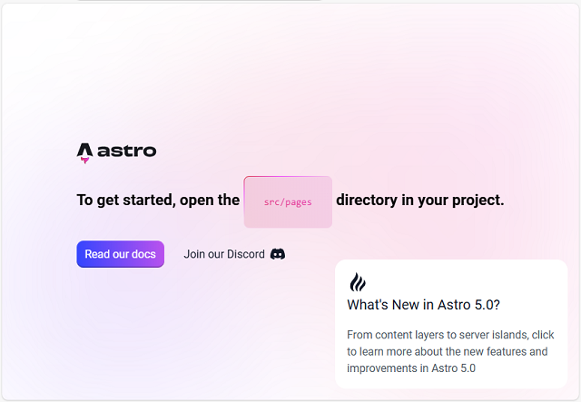

# Astro Starter Kit: Basics

```sh
npm create astro@latest -- --template basics
```

[](https://stackblitz.com/github/withastro/astro/tree/latest/examples/basics)
[](https://codesandbox.io/p/sandbox/github/withastro/astro/tree/latest/examples/basics)
[](https://codespaces.new/withastro/astro?devcontainer_path=.devcontainer/basics/devcontainer.json)

> 🧑‍🚀 **Seasoned astronaut?** Delete this file. Have fun!


## 🚀 Project Structure

Inside of your Astro project, you'll see the following folders and files:

```text
/
├── public/
│   └── favicon.svg
├── src/
│   ├── layouts/
│   │   └── Layout.astro
│   └── pages/
│       └── index.astro
└── package.json
```

To learn more about the folder structure of an Astro project, refer to [our guide on project structure](https://docs.astro.build/en/basics/project-structure/).

## 🧞 Commands

All commands are run from the root of the project, from a terminal:

| Command                   | Action                                           |
| :------------------------ | :----------------------------------------------- |
| `npm install`             | Installs dependencies                            |
| `npm run dev`             | Starts local dev server at `localhost:4321`      |
| `npm run build`           | Build your production site to `./dist/`          |
| `npm run preview`         | Preview your build locally, before deploying     |
| `npm run astro ...`       | Run CLI commands like `astro add`, `astro check` |
| `npm run astro -- --help` | Get help using the Astro CLI                     |

## 👀 Want to learn more?

Feel free to check [our documentation](https://docs.astro.build) or jump into our [Discord server](https://astro.build/chat).

## Start project 

- start with this command and select best option , in this case I selected minimal:

```
npm create astro@latest

> npx
> create-astro


 astro   Launch sequence initiated.

   dir   Where should we create your new project?
         ./lunar-light

  tmpl   How would you like to start your new project?
         A basic, minimal starter

  deps   Install dependencies?
         Yes

      ✔  Project initialized!
         ■ Template copied
         ■ Dependencies installed
         ■ Git initialized

  next   Liftoff confirmed. Explore your project!

         Enter your project directory using cd ./lunar-light
         Run npm run dev to start the dev server. CTRL+C to stop.
         Add frameworks like react or tailwind using astro add.

         Stuck? Join us at https://astro.build/chat
```

## Run project 

- I used this command on my project folder:

```
lunar-light>npm run dev

> lunar-light@0.0.1 dev
> astro dev

▶ Astro collects anonymous usage data.
  This information helps us improve Astro.
  Run "astro telemetry disable" to opt-out.
  https://astro.build/telemetry

15:13:35 [types] Generated 1ms

 astro  v5.0.5 ready in 286 ms

┃ Local    http://localhost:4321/
┃ Network  use --host to expose

15:13:35 [content] Syncing content
15:13:35 [content] Astro version changed
15:13:35 [content] Clearing content store
15:13:35 [content] Synced content
15:13:35 watching for file changes...
```

- the webpage come into pink color with this text and some graphic user interface :

```
To get started, open the src/pages directory in your project.
```

## Use astro command, see https://docs.astro.build/en/reference/cli-reference :

- open a new terminal into the project folder and run this command:

```
lunar-light>npm run astro preferences disable devToolbar

> lunar-light@0.0.1 astro
> astro preferences disable devToolbar

◯ devToolbar is now  disabled
...
```

- reopen the webpage with:

```
lunar-light>npm run dev

> lunar-light@0.0.1 dev
> astro dev

15:20:17 [types] Generated 1ms

 astro  v5.0.5 ready in 193 ms

┃ Local    http://localhost:4321/
┃ Network  use --host to expose

15:20:17 [content] Syncing content
15:20:17 [content] Synced content
15:20:17 watching for file changes...
15:20:22 [200] / 27ms
...
```

## Using cypress for testing :

 - install the cypress 

```
lunar-light>npm install cypress --save-dev

added 183 packages, and audited 455 packages in 11s

174 packages are looking for funding
  run `npm fund` for details

found 0 vulnerabilities

...
lunar-light>npm install cypress --save-dev --foreground-scripts

up to date, audited 455 packages in 2s

174 packages are looking for funding
  run `npm fund` for details

found 0 vulnerabilities

...

```

 - I removed the basic scripts and I create a new spec.cy.js file into e2e folder with my source code;
 - I created a new cypress.config.js file into main project folder with this source code:
 
 ```
 import { defineConfig } from 'cypress'

export default defineConfig({
  e2e: {
    baseUrl: 'http://localhost:4321',
    supportFile: false
  },
})

```
 - Run the project with:
```
npm run dev

> lunar-light@0.0.1 dev
> astro dev

15:20:17 [types] Generated 1ms

 astro  v5.0.5 ready in 193 ms

┃ Local    http://localhost:4321/
┃ Network  use --host to expose

15:20:17 [content] Syncing content
15:20:17 [content] Synced content
15:20:17 watching for file changes...
15:20:22 [200] / 27ms
```
 - The result is this:
   


 - The cypress file can be tested on cypress browser with: 
 
 ```
 lunar-light>npx cypress open


DevTools listening on ws://127.0.0.1:57125/devtools/browser/
...
```
